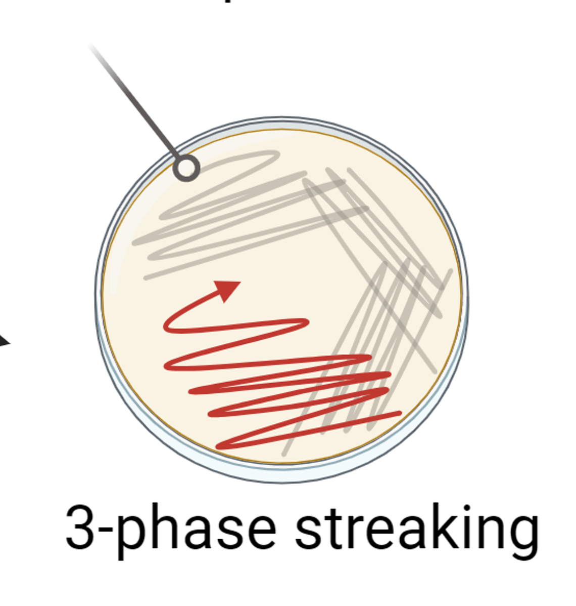

# Cell culture

## Medium formulation
### LB
Volume: 200 mL  
|Materials|Final conc.|Amount|
|---|---|---|
|Tryptone|10 g/L|2g|
|Yeast extract|5 g/L|1g|
|Sodium chloride|10 g/L|2g|  

*Adjust pH to 7 with NaOH or KOH
*Autoclave for 20 min  

### 5xM9 Salt
Volume: 100 mL
|Materials|Final conc.|Amount|
|---|---|---|
|$Na_2HPO_4$|33.9 g/L|3.38 g|
|$KH_2PO_4$|15 g/L|1.5 g|
|NaCL|2.5 g/L|0.25 g|
|$NH_4Cl$|5 g/L|2 g|

*Adjust pH to pH7
*Autoclave for 20 min

### 600 g/L Glucose
Volume: 100 mL
|Materials|Final conc.|Amount|
|---|---|---|
|Glucose|600 g/L|60 g|

*Autoclave for 20 min

### 1xM9 medium
Volume: 20 mL
|Materials|Final conc.|Amount|
|---|---|---|
|5xM9 Salt|1x|4 mL|
|600 g/L Glucose|4 g/L|133 uL|
|1M $CaCl_2$|0.3 mM|6 uL|
|1M $MgSO_2$|1 mM|20 uL|
|Sterilized $ddH_2O$||15.841 mL|

*M9 medium should be freshly prepared every time.  
*Remember to check if sterilized ddH2O is enough before day of culture.  


### 1xM9T medium
Volume: 20 mL
|Materials|Final conc.|Amount|
|---|---|---|
|5xM9 Salt|1x|4 mL|
|600 g/L Glucose|4 g/L|133 uL|
|1M $CaCl_2$|0.3 mM|6 uL|
|1M $MgSO_2$|1 mM|20 uL|
|4 g/L Tryptone|2 g/L|10 mL|
|Sterilized $ddH_2O$||5.841 mL|

*Yeast extract or tryptone can not be autoclaved together with glucose. (See Maillard reactions for further information)  

### 1xM9C3T medium
Volume: 20 mL
|Materials|Final conc.|Amount|
|---|---|---|
|5xM9 Salt|1x|4 mL|
|45% glycerol|4 g/L|178 uL|
|1M $CaCl_2$|0.3 mM|6 uL|
|1M $MgSO_2$|1 mM|20 uL|
|4 g/L Tryptone|2 g/L|10 mL|
|Sterilized $ddH_2O$||5.796 mL|

### 45% Glycerol
Volume: 200 mL
|Materials|Final conc.|Amount|
|---|---|---|
|Glycerol|45%|90 g|
|$ddH_2O$|55%|110 g|

*Autoclave for 20 min  

### TB medium
Volume: 100 mL
|Materials|Final conc.|Amount|
|---|---|---|
|Tryptone|12 g/L|1.2 g|
|Yeast extract|24 g/L|2.4 g|
|$K_2HPO_4$|10.928 g/L|1.0928 g|
|$KH_2PO_4$|5.07 g/L|0.507 g|
|Sterilized $ddH_2O$||100 mL|  

*Autoclave for 20 min  
*Add 178 uL of 45% glycerol for each 20 mL TB medium before inoculation.  

### 5xMM9Y
Volume: 100 mL  
|Materials|Final conc.|Amount|
|---|---|---|
|$Na_2HPO_4$ anhydrous|31.75 g/L|3.175 g|
|$KH_2PO_4$|15 g/L|1.5 g|
|$(NH_4)_2SO_4$|80 g/L|8 g|
|Yeast extract|10 g/L|1 g|

*Adjuct pH to 7 using ammonia
*Autoclave for 20 min

### 1xMM9Y medium
Volume: 30 mL
|Materials|Final conc.|Amount|
|---|---|---|
|5xMM9Y|1x|6 mL|
|600 g/L glucose|20 g/L|1 mL|
|50 g/L $MgSO4\dot 7H_2O$|0.5 g/L|300 uL|
|$MnSO_4\dot H_2O$|0.01 g/L|30 uL|
|Sterilized $ddH_2O$||18.5 mL|

#### Induction mix for ALA production
|Materials|Final conc.|Amount|
|---|---|---|
|200 g/L Glycine|4 g/L|600 uL|
|50 g/L Succinate|1 g/L| 600 uL|
|20 mM PLP|33.33 uM|50 uL|
|100 g/L Ferric citrate|0.1 g/L|30 uL|
|100 mM IPTG|0.1 mM|30 uL|

*Add the induction mix to ALA production culture at OD 0.6-0.8  

### LB+2%NaCl
Volume: 4 mL
|Materials|Final conc.|Amount|
|---|---|---|
|LB medium|1x|4 mL|
|250 g/L NaCl|20 g/L|320 uL|

*Sterilize 250 g/L NaCl by filtering


## Agar
### LB plate
Volume: 200 mL
|Materials|Final conc.|Amount|
|---|---|---|
|Agar|15 g/L|3g|
|LB broth|25 g/L|5g|  

*Autoclave for 20min  


## Antibiotics
### Ampicillin (Ap)
Stock: 100 mg/mL  
Working conc.: 100 ug/mL  
Dilution factor: 1000x  

###  Kanamycin (Km)
Stock: 50 mg/mL  
Working conc.: 50 ug/mL  
Dilution factor: 1000x  

### Chloramphenicol (Cm)
Stock: 50 mg/mL  
Working conc. 25 ug/mL  
Dilution factor: 2000x   


## Chassis
-   BD
-   B7G
-   BKJ
-   BTF
-   C43
-   C7G
-   CkJ
-   DH5a
-   W3110
-   MG1655
-   Nissle
-   RcI
-   Vn

## Regular culture  

### Strain activation  
Perform 3-phase streaking from the glycerol stock and culture the plate at 30C or 37C depending the cell to be activated.   


### Preculture  
1. Prepare 4 mL LB medium.
2. Pick a colony from the plate. 
3. Drop the tip into the LB medium.
4. Culture for 8-12 hr.

### Subculture  
1. Inoculate 1-2% preculture into fresh medium. (Ex: 80 uL preculture into 4 mL fresh LB medium; 400 uL preculture into 20 mL fresh LB medium).  
2. Culture at 37C until OD 0.6-0.8 
3. Induce with IPTG 
4. Transfer the culture to 30C or 22C for recombinant protein production.  
5. Monitor cell growth every 3 hr.  
6. Harvest the cell at 24 hr for further analysis.  

##  Stock preservation
1. Make label for the strain:  
fontsize: 8 pt  
lineheight: 8 pt  
```
BI-6 B7
pSB4KI-TrcBH4-sfGFP/DH5a
20240218 JJJ
```  
2. Add 300 uL 45% glycerol into the preservation tubes. 
3. Add 600 uL subcutlure into the preservation tubes. (The final glycerol concentration should be 15%).
4. Flash freeze the cell using liquid nitrogen.  
5. Put into -80C freezer and record the location on the sheet.  

