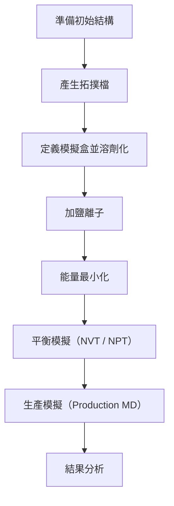

# Lecture 8. Molecular dynamics
課程時間:4小時

## 🧪 一、什麼是分子動力學（MD）？
分子動力學是一種模擬原子與分子在時間尺度下運動的計算方法。

核心概念：
- 運動遵循牛頓運動方程式。

- **力場（Force Field）**用來描述系統的勢能。

- **統計系綜（Ensemble）**控制模擬條件（如 NVE、NVT、NPT）。

- **時間步長（time step）**約為 1–2 fs（飛秒），模擬總時間從 ps 到 µs 不等。

## 🖥️ 二、GROMACS 軟體簡介
GROMACS 是一套開源、高效能的分子動力學模擬軟體，廣泛應用於生物分子模擬。

主要特色：
- 支援 CPU 與 GPU 加速

- 開源、可自由使用

- 支援多種常見力場（AMBER、CHARMM、OPLS-AA 等）

- 提供結構處理、模擬與後續分析工具

## 🧰 三、GROMACS 模擬流程概覽


## 🔧 四、基本指令與常見檔案格式
常見輸入檔案：
- `.pdb` / `.gro`：分子結構檔

- `.top`：拓撲主檔案

- `.mdp`：模擬參數

- `.itp`：拓撲附檔案

- `.tpr`：整合後的模擬二進位檔
常見指令範例：
```bash

gmx pdb2gmx -f protein.pdb -o processed.gro -water spce
gmx editconf -f processed.gro -o boxed.gro -c -d 1.0 -bt cubic
gmx solvate -cp boxed.gro -cs spc216.gro -o solvated.gro -p topol.top
gmx grompp -f ions.mdp -c solvated.gro -p topol.top -o ions.tpr
gmx genion -s ions.tpr -o ionized.gro -p topol.top -pname NA -nname CL -neutral

```

Gromacs提供`gmx dump`來檢查這些二進位檔案的內容:
```
gmx dump -s md.tpr | less
gmx dump -s md.xtc | less
```

## 🔬 五、平衡與生產模擬
###    能量最小化：
```bash
gmx grompp -f minim.mdp -c ionized.gro -p topol.top -o em.tpr
gmx mdrun -deffnm em
```

### 溫度與壓力平衡（NVT / NPT）：
```bash
gmx grompp -f nvt.mdp -c em.gro -r em.gro -p topol.top -o nvt.tpr
gmx mdrun -deffnm nvt

gmx grompp -f npt.mdp -c nvt.gro -r nvt.gro -t nvt.cpt -p topol.top -o npt.tpr
gmx mdrun -deffnm npt
```
### 生產模擬：
```bash
gmx grompp -f md.mdp -c npt.gro -t npt.cpt -p topol.top -o md.tpr
gmx mdrun -deffnm md
```

### 消去週期性邊界(PBC)
PBC 是為了解決模擬系統大小有限的問題。  
模擬盒子外層的粒子，會有“影子盒子”來模擬無限系統。每當一個分子走出模擬盒子，它會從對面「回來」，彷彿是在無限大的環境中，但是這在用視覺化軟體觀察時會看到分子斷成兩半、順移或分子拖曳的奇怪現象，因此需要在模擬完成後消去PBC來產生合理的軌跡檔案。  
PBC的去除沒有固定方法，需要根據分子軌跡檔中出現的現象來逐一處理，建議的流程參考如下:

```
# 當蛋白分子有部分原子在盒子外拖曳的現象，使用whole來維持蛋白質的完整性

gmx trjconv -s topol.tpr -f traj.xtc -o traj_whole.xtc -center -pbc whole

# 如果模擬有兩個分子，可以組成cluster維持兩分子在附近的狀態

gmx trjconv -s topol.tpr -f traj_whole.xtc -o traj_cluster.xtc -pbc cluster

# 前兩步驟處理完還是看到有一分子在盒子外順移，可以透過nojump把第一幀當作參考，把跳躍的分子拉回來(這一步只有在遇到分子順移時才需要)

gmx trjconv -s equlibration.gro -f traj_cluster.xtc -o traj_nojump.xtc -pbc nojump

# 只有一個分子可以用以下指令將分子放到盒子中心方便觀察。center指令會移動原子座標，這一步之後不可以再用nojump，因為參考位置已經不同了!
gmx trjconv -s topol.tpr -f traj_nojump.xtc -o traj_center.xtc -center -pbc mol -ur compact

# 分子會有旋轉及平移，我們可以用fit來消除，方便觀察
gmx trjconv -s topol.tpr -f traj_center.xtc -o traj_fit.xtc -fit rot+trans

```

## 📊 六、軌跡與結果分析

常用分析工具：
- RMSD：`gmx rms`

- 分子半徑：`gmx gyrate`

- 氫鍵分析：`gmx hbond`

- 能量：`gmx energy`

- 原子間距離：`gmx distance`

- 聚類分析：`gmx cluster`


## References
1. http://www.mdtutorials.com/gmx/